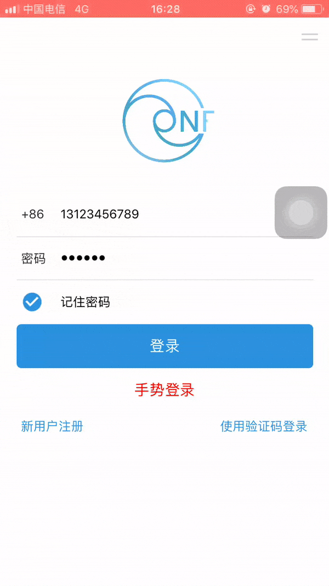
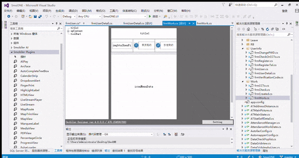

##  SmoONE 4.6
### 办公管理系统

SmoONE是通过Smobiler开发的一款办公管理系统。  
IDE为VisualStudio，开发平台为Smobiler，SmobilerDesigner通过实现.NET的component组件方式，借助VisualStudio集成开发环境来开发移动应用。SmobilerClient是通用的框架客户端，使用自有的stml协议实现客户端的原生控件渲染和事件。云平台可在云端生成Android和IOS的安装文件。
SmoONE is an office management solution for APPs, developed by .NET. The development environment is VisualStudio, the development platform is Smobile  

      

也可前往Gitee码云获取源码，https://gitee.com/smobiler/SmoONE  

### 环境要求

Android版本：支持Android 4.4及以上版本  
IOS版本：支持IOS 9.0及以上版本  
### 源代码运行环境要求
.NET FrameWork版本: .支持NET FrameWork 4.0及以上版本  
Visual Studio版本：支持Visual studio 2010及以上版本  
SmobilerDesigner版本：460及以上([下载并安装SmobilerDesigner](https://www.smobiler.com/SmobilerDesigner.exe)) 

### SmobilerClient（开发调试客户端）获取

[Android版调试客户端](https://www.smobiler.com/Smobiler.apk)          
[iOS版调试客户端](https://www.smobiler.com/download.html) (使用iPhone/iPad的safari浏览器打开此链接)   
注意：该项目客户端版本为4.6.0及以上，designer版本为460及以上，项目使用的designer和客户端版本必须保持一致！！
### 打开项目

确认.NET FrameWork已安装且版本正确。   
确认Visual Studio已安装且版本正确。   
确认SmobilerDesigner已安装且版本正确。   
下载源码，在VisualStudio中打开。

### 调试

确认SmobilerClient已安装至手机且版本正确。    
点击“启动“。   
手机打开SmobilerClient，“扫一扫”，扫描二维码。

注意：请确保手机和服务器处于同一局域网
### 相关资料

1. 该源码已打包成app，可点击这里下载进行初步体验 (https://apps.smobiler.com/)
2. 点击查看Smobiler Designer/Client下载(http://www.smobiler.com/download.html)
3. 点击查看一键学习(http://www.smobiler.com/studyPC.aspx)
4. 点击查看Smobiler官网 (http://www.smobiler.com/)
5. 若出现图标无法显示的情况，是因为开启了防火墙，点击查看设置(http://www.smobiler.com/forum.php?mod=viewthread&tid=12)
6. QQ群：308522976

该项目客户端版本为4.6.0，design版本为460，项目使用的design和客户端版本必须保持一致！！！

如果需要4.3版本，请使用4.3分支！ https://github.com/comsmobiler/SmoONE/tree/4.3

(https://img.shields.io/github/license/mashape/apistatus.svg)
